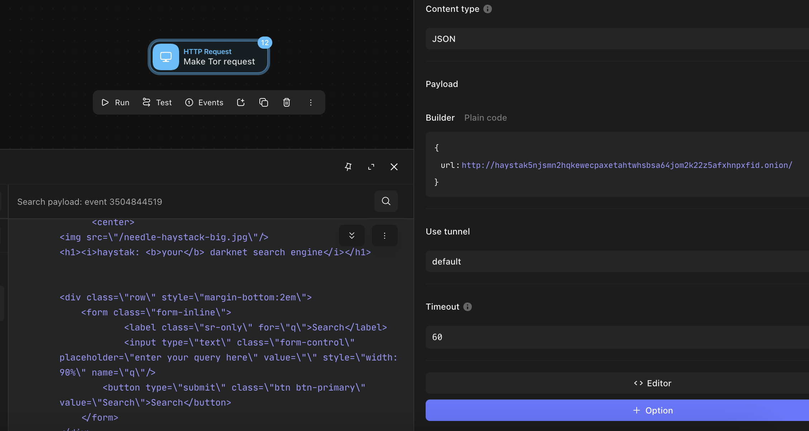

# Tines Tor Proxy

Proof of concept to connect to Tor resources via Tines.

## Requirements
- Docker
- Docker Compose
- Tines Tunnel (or run an open SOCKS proxy)

## Run service

```
docker compose up -d
```

## Configure Tines

The server is available at `http://onion:8080/fetch`. It will pass along the request payload to the Tor proxy. Use parameters like URL, headers, method, etc to modify the request.

```
{
  "url": "http://onion:8080/fetch",
  "method": "post",
  "content_type": "application_json",
  "payload": {
    "url": "http://haystak5njsmn2hqkewecpaxetahtwhsbsa64jom2k22z5afxhnpxfid.onion/"
  },
  "use_tunnel": true,
  "timeout": "60"
}
```


